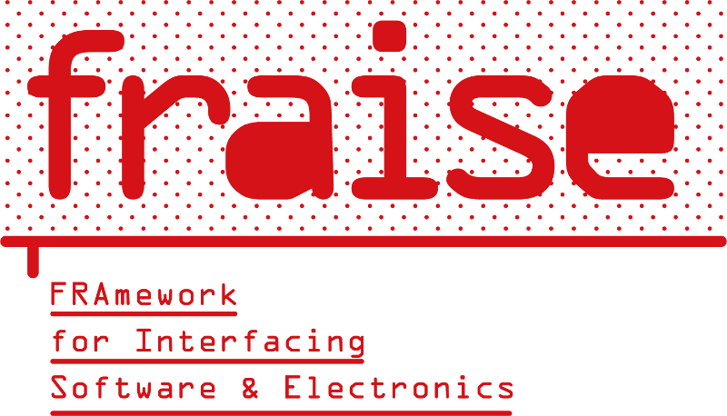

--------------------------------

[**Fraise**](https://github.com/MetaluNet/Fraise) is an easy yet powerful way to build programs for microcontroller boards, that can communicate together and with [Pure Data](http://www.puredata.info) (Pd).

Fraise is at the same time:

-	an Pd-hosted easy-to-install integrated environment, for programming and flashing the Fraise boards, then interacting with them.
-	a protocol establishing a communication between multiple boards and the host computer
-	a C/C++ firmware-level API, implementing the Fraise protocol plus various hardware-specific modules

Two different kinds of microcontroller boards are currently supported by Fraise:

- the [RaspberryPi Pico](https://www.raspberrypi.com/products/raspberry-pi-pico/) is the more powerful, and is readily available from many retailers at low cost; most other RO2040 based boards should be easily supported too.
- the various legacy Fraise boards are powered by Microchip's PIC18F26K22; they are currently only manufactured at home for personal use. They have more analog inputs, and are 5V compliant; unfortunately they require the use of SDCC compiler, which isn't maintained anymore for PIC targets.

--------------------------------

## single or multiple boards

In simple cases, a single board will suffice for the interfacing needs of the application.
In these cases, Fraise already shows its usefulness in offering both a development environment and a communication solution.

But Fraise also allows multiple boards to be connected to each other, and to communicate with the host computer via the only USB connection of the first board.  
The program of the first board indeed implements the master-side of the *Fraise protocol*, which can connect to up to 127 other boards (in the simplest case, the *Fraise bus* is formed by shorting Pico's pins 20 and 21; the buses of the all the boards simply need to be connected together).

The Fraise protocol is based on 9-bit asynchronous serial communication. Thanks to a carefully selected, moderate bitrate (250 kbs), the microcontroller boards can be located hundreds of meter away from the computer when connected through RS485 transceivers (called Fraiseivers).  

This unique feature allows to build fairly complex installations, involving multiple distant sensors/actuators sets, that communicate reliably via wire with the central application, with minimal latency.

--------------------------------

## installation

Fraise requires Pure Data version 0.54 or later.

Fraise can be installed through the built-in Pd externals installer, aka Deken (menu Help/Find externals), search for the **"Fraise"** library.  

In order to develop Fraise firmwares by yourself, you will need the compilation toolchain (gcc, sdcc, cmake...) which is also available from Deken, install the **"Fraise-toolchain"** library for your system.

On **Linux**: you may need to authorize your user to use the USB serial devices; just type in a terminal:  
`sudo adduser [your_username] dialout`  
then logout (close your session) and re-login.

--------------------------------

## example

1. connect the Pico board in BOOTSEL mode via USB (you may need to hold down the BOOTSEL button if the boards has been previously programmed with another firmware)
2. copy the file `boards/pico/usb_bootloader.uf2` to the Pico's mass-storage directory, which should have been created
3. open `pico/fraise/example/blink.pd` with Pd.
4. move the upper **led period** slider, and see how the Pico LED flashes at different speeds.

--------------------------------
## documentation

General documentation for Fraise is available in the (WIP) [Wiki](https://github.com/MetaluNet/Fraise/wiki), for a start take a look at the [First-steps](https://github.com/MetaluNet/Fraise/wiki/1.-First-steps) page.  
The doxygen-generated documentation for the Fraise firmware API is published there: [Fraise API doc ](http://metalunet.github.io/Fraise-doc).  
The specification of the low-level Fraise protocol is described here: [protocol.md](doc/protocol.md).  

Also, you can have a look at the short overview and history hosted by [metalu.net](http://metalu.net/en/outils/fraise-overview).

--------------------------------
Fraise code is hosted at <https://github.com/MetaluNet/Fraise>,  
the toolchain builder at <https://github.com/MetaluNet/Fraise-toolchain>.

**[metalu.net](http://metalu.net) / [Métalu A Chahuter](http://http://metaluachahuter.com)** is an artistic collective, where Fraise boards are widely used to build all kind of installations involving sound, light, control interfaces, motor control...

	Antoine Rousseau @ metalu.net 2007-2024  
license : GNU GPL (see [LICENSE.txt](LICENSE.txt) )
